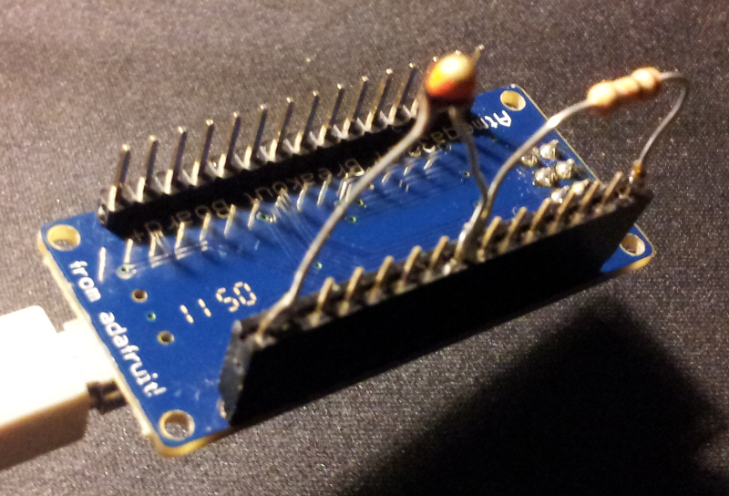
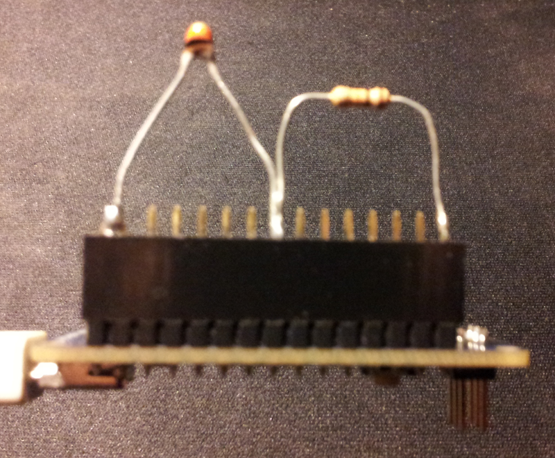
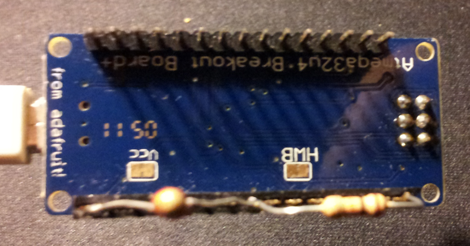

USB Temperature Sensor
======================

This is an USB temperature sensor based on the [Atmega32u4 Breakout+](http://www.ladyada.net/products/atmega32u4breakout/) board of Adafruit Industries.  I used the [Adafruit thermistor guide](http://learn.adafruit.com/thermistor/using-a-thermistor) and the [LUFA library](http://www.fourwalledcubicle.com/LUFA.php) to make this project happen.

Installation
------------

The following `make` directives are available:
`build` (default): Fetch LUFA, copy the firmware source into its directory tree and build the firmware.
`program`: Program the board using the firmware.
`clean`: Clean up all the intermediate files that were created during the build process.

Place `90-temperature-sensor.rules` to `/etc/udev/rules.d` so that udev will create the `dev/temperature-sensor` symlink every time the sensor is plugged in.

Usage
-----

After building and uploading the firmware use host-utils/get-temperature.py to retrieve the temperature value.

Photos
------

